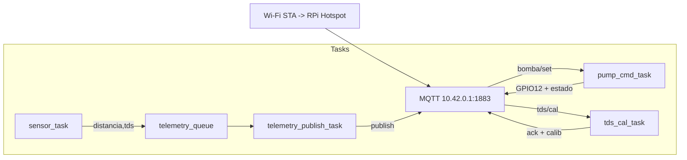
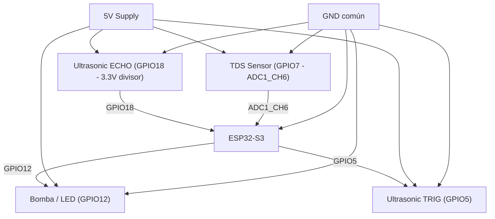

# Proyecto Tanque de Agua(ESP32-S3)

Firmware para ESP32-S3 que actúa como STA+AP, se conecta al broker MQTT en `10.42.0.1:1883`, publica sensores (ultrasonido y TDS) y controla una bomba (GPIO12) vía tópicos MQTT. Incluye colas/tareas FreeRTOS y comandos de calibración TDS.

## Hardware
- MCU: ESP32-S3 (flash 2 MB).
- Broker/host: Raspberry Pi (hotspot `RPi-Hotspot`, pass `12345678`).
- Bomba/LED: GPIO12.
- Ultrasonido: TRIG GPIO5, ECHO GPIO18 (ECHO debe ir a 3.3 V mediante divisor o level shifter), VCC 5 V, GND común.
- TDS: ADC1 canal 6 → GPIO7 en ESP32-S3 (alimentar según sonda; GND común).

## MQTT
- Entrada:
  - `cisterna/bomba/set` → `ON`/`OFF` o `1`/`0`.
  - `cisterna/tds/cal` → comandos `calA`, `calB`, `save`, `load` (calibración TDS).
- Salida:
  - `cisterna/bomba/state` → estado `ON`/`OFF`.
  - `cisterna/ultrasonido` → distancia cm (`%.2f`).
  - `cisterna/tds` → lectura TDS (`%.2f`).
  - `cisterna/tds/cal/ack` → respuesta a calibración (raw/offset/gain/estado).

## Tareas y colas (FreeRTOS)
- `sensor_task`: lee ultrasonido/TDS y encola telemetría.
- `telemetry_publish_task`: publica MQTT lo que llegue en la cola de telemetría.
- `pump_cmd_task`: consume cola de comandos de bomba, maneja GPIO12 y publica estado.
- `tds_cal_task`: procesa comandos de calibración TDS y responde con ACK.
- Colas: `pump_cmd_queue`, `telemetry_queue`, `tds_cmd_queue`.

## Calibración TDS (via Node-RED/MQTT)
1) Sensor en agua base (0 ppm aprox): enviar `calA` a `cisterna/tds/cal`.
2) Sensor en solución de referencia: enviar `calB` (usa raw actual para ganar).
3) Enviar `save` para guardar en NVS (persistente). `load` recarga calibración.
4) Monitorear `cisterna/tds/cal/ack` y la consola para ver raw/offset/gain.

## Build y flash
```bash
. ~/esp/esp-idf/export.sh
idf.py set-target esp32s3
idf.py -p /dev/ttyACM0 build flash monitor   # ajusta puerto si es necesario
```

## Diagrama de software (tareas/colas/MQTT)


## Diagrama de hardware



